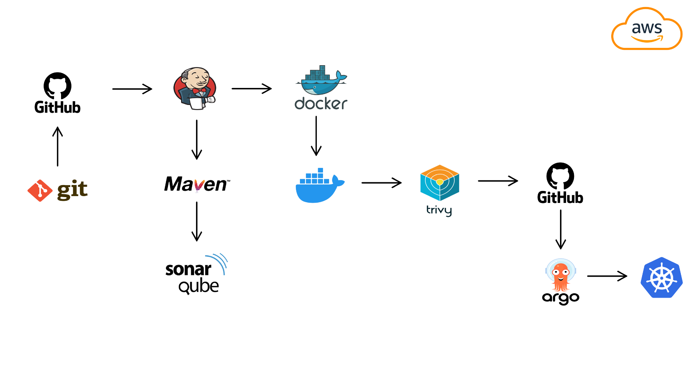
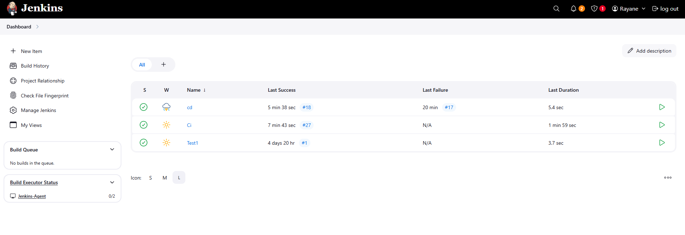
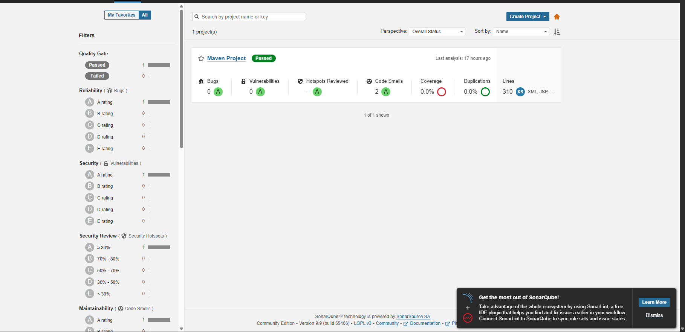
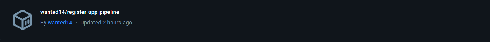
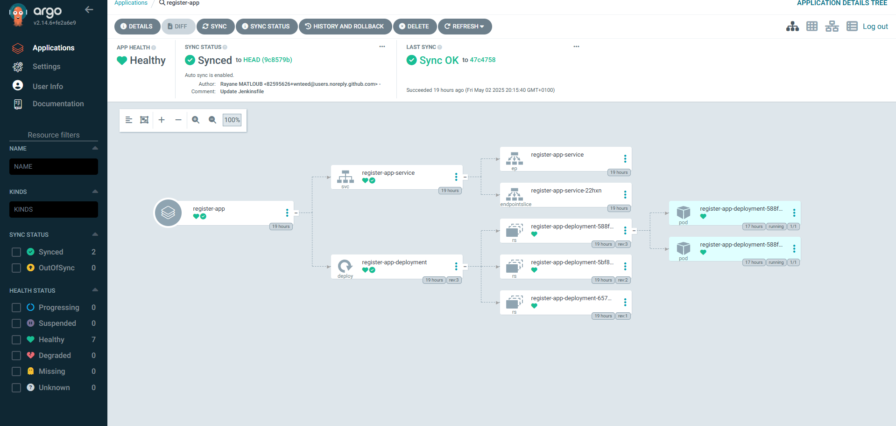
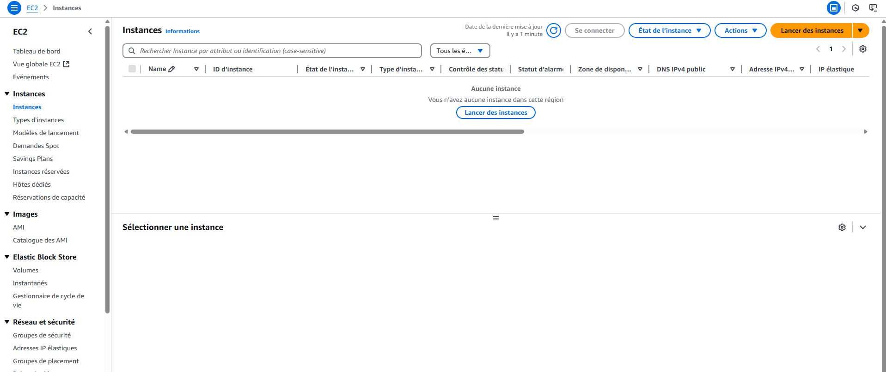
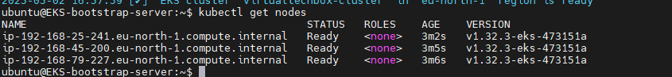
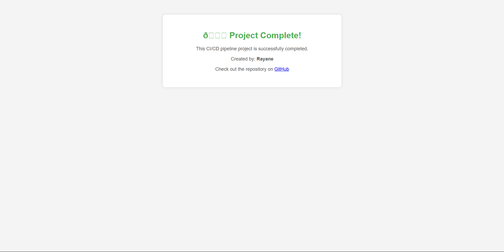

# 🚀 Projet DevOps : Déploiement Automatisé d'une Application d'Inscription

Bienvenue dans ce projet DevOps complet qui démontre la mise en place d'une chaîne CI/CD automatisée pour une application d'inscription, en utilisant des outils modernes et des meilleures pratiques de l'industrie.

## 🧩 Aperçu du Projet

Ce projet est divisé en deux parties principales :

1. **Application d'Inscription** : [Lien vers le dépôt GitHub](https://github.com/wnteed/registration-app/)
2. **Infrastructure GitOps** : [Lien vers le dépôt GitHub](https://github.com/wnteed/gitops-registration-app/)

L'objectif est de montrer comment une application peut être développée, testée, analysée, conteneurisée et déployée automatiquement dans un cluster Kubernetes sur AWS, en utilisant une approche GitOps.

## 🛠️ Technologies Utilisées

- **AWS EC2** : Hébergement des serveurs Jenkins, SonarQube et du cluster EKS.
- **Jenkins** : Automatisation des processus de build, test et déploiement.
- **Maven** : Gestion des dépendances et compilation du projet Java.
- **SonarQube** : Analyse de la qualité du code.
- **Docker** : Conteneurisation de l'application.
- **Docker Hub** : Registry pour stocker les images Docker.
- **Kubernetes (EKS)** : Orchestration des conteneurs.
- **Argo CD** : Déploiement continu basé sur GitOps.
- **GitHub** : Gestion du code source et des configurations.

## 🔄 Flux de Travail CI/CD

1. **Développement** : Les développeurs poussent le code vers le dépôt GitHub.
2. **Intégration Continue (CI)** :
   - Jenkins détecte les changements et déclenche un pipeline.
   - Le code est compilé avec Maven.
   - SonarQube analyse la qualité du code.
   - Une image Docker est construite et poussée vers Docker Hub.
3. **Déploiement Continu (CD)** :
   - Argo CD surveille le dépôt GitOps.
   - Lorsqu'une nouvelle image est disponible, Argo CD met à jour le cluster Kubernetes avec la nouvelle version de l'application.

## 📸 Captures d'Écran

### Jenkins - Pipeline CI

### SonarQube - Analyse du Code

### Docker Hub - Image de l'Application

### Argo CD - Déploiement GitOps

### AWS EC2 Instance Dashboard**
  

### Kubernetes Cluster Nodes**
  

### Project Completion Confirmation**
  

## 📂 Structure des Dépôts

- **registration-app** : Contient le code source de l'application, le fichier `Jenkinsfile` pour le pipeline CI, et le `Dockerfile` pour la création de l'image Docker.
- **gitops-registration-app** : Contient les manifestes Kubernetes et les configurations nécessaires pour Argo CD.

## 🚀 Déploiement avec Argo CD

Argo CD est configuré pour surveiller le dépôt `gitops-registration-app`. Lorsqu'un changement est détecté (par exemple, une nouvelle image Docker), Argo CD synchronise automatiquement l'état du cluster Kubernetes avec les fichiers de configuration, assurant ainsi un déploiement cohérent et automatisé.

## 📌 Prérequis pour Reproduire le Projet

- Un compte AWS avec les permissions nécessaires pour créer des instances EC2 et un cluster EKS.
- Jenkins installé et configuré sur une instance EC2.
- SonarQube installé sur une instance EC2.
- Docker installé sur les instances nécessaires.
- Un cluster Kubernetes (EKS) opérationnel.
- Argo CD installé dans le cluster Kubernetes.
- Comptes GitHub et Docker Hub pour stocker le code source et les images Docker.

## 🤝 Contribution

Les contributions sont les bienvenues ! Si vous souhaitez améliorer ce projet, n'hésitez pas à forker le dépôt et à soumettre une pull request.
